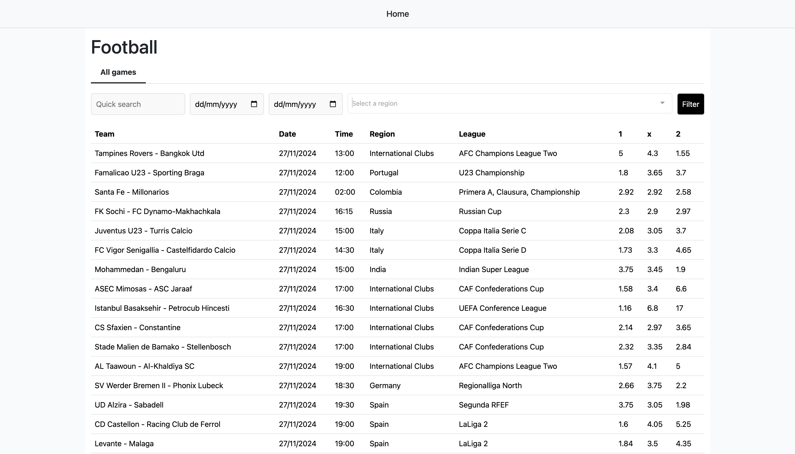
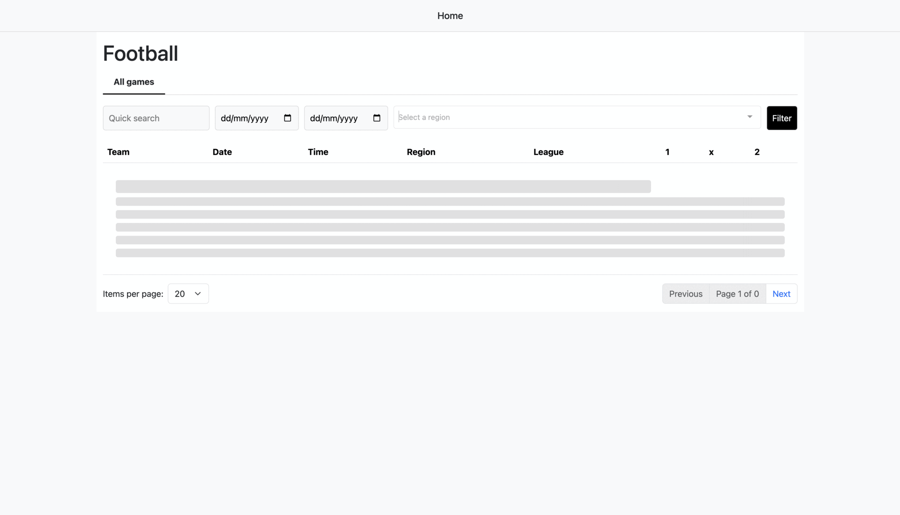
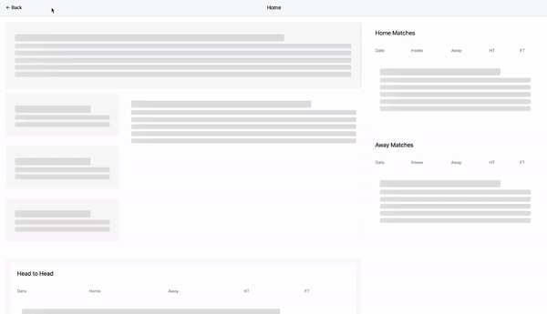

**sport-insight**

Sport Insight provides an in-depth exploration of football match data, offering fans and analysts a powerful tool to understand team performance and match dynamics.

**Upcoming Matches Overview**

**Comprehensive Match Listing:** View all upcoming matches

- **Detailed Odds Information:**
  - Home team odds
  - Away team odds
  - Draw odds

**Match Stats Page**

When you select a match, dive into comprehensive statistics:

**Head-to-Head Analysis**

- Historical Encounters Table: Complete history of past matches between the two teams

**Team Performance Insights**

- Home Matches Table: Performance in home games
- Away Matches Table: Performance in away games

**Recent Form Snapshot**

- **Last 5 Matches Summary:**
  - Represented as W (Win), L (Loss), D (Draw)
  - Quick visual representation of recent team performance

**Interactive Charts**
Analyze historical match data with interactive charts:

- Over 1.5 Goals
- Over 2.5 Goals
- Over 3.5 Goals
- Draws/No Draw Analysis

**🚀 Quick Start**
**Prerequisites**

- Node.js
- API Key from https://scalesp.com

**Backend Setup**

    # Clone the repository

git clone https://github.com/CodeWithKola/sport-insight.git
cd sport-insight/backend

    # Install dependencies

npm install

    # Create .env file

echo "SPORT_API_URL=https://app.scalesp.com/api/v1
SPORT_API_KEY=your-api-key-here
PORT=5008" > .env

    # Start backend server

npm start

**Frontend Setup**

    # Navigate to frontend directory

cd ../frontend

    # Install dependencies

npm install

    # Create .env file

echo "VUE_APP_BACKEND_URL=http://localhost:5008" > .env

    # Launch development server

npm run serve

🤝 **Contributing**

Contributions are welcome! Please check out our Contributing Guidelines.

**Found an Issue?**

- Open a GitHub Issue
- Provide detailed description
- Include steps to reproduce

📄 License
This project is licensed under the MIT License - see the LICENSE file for details.
